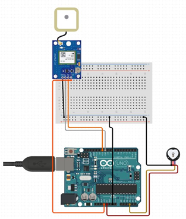
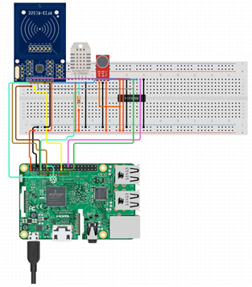
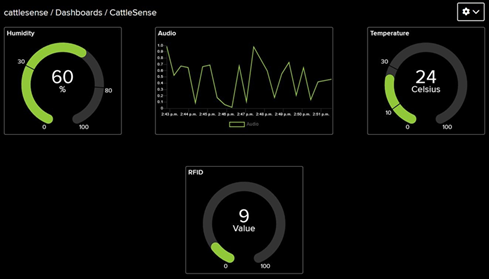

# CattleSense: An IoT Approach to Optimize Cattle Well-Being

This repository contains the hardware schematics and Arduino source code for the "CattleSense" project, a multisensory IoT system designed for comprehensive livestock monitoring.

**Authors:** Srijesh Pillai, Dr. M. I. Jawid Nazir

---

## Abstract
> CattleSense is an innovative application of Internet of Things (IoT) technology for the comprehensive monitoring and management of cattle well-being. This research outlines the design and implementation of a sophisticated system using a Raspberry Pi, Arduino, and various sensors (RFID, GPS, Heartbeat, DHT11, Microphone). The system aims to provide real-time surveillance of the environment and individual cattle parameters, ensuring the herd is healthy and safe.

---

## System Architecture

The CattleSense system is built on a two-part architecture: a low-power **Node** attached to each animal, and a central **Aggregator** that collects and processes the data.

| IoT Node (On each Cow) | Central Aggregator (Raspberry Pi) |
| :---: | :---: |
|  |  |

*   **The Node:** An Arduino-based unit that collects physiological (heartbeat) and location (GPS) data. It transmits this information wirelessly.
*   **The Aggregator:** A Raspberry Pi that receives data from all nodes, gathers environmental data (temperature, humidity, audio), identifies individual cows (RFID), and serves a dashboard for real-time monitoring.

---

## Live Monitoring Dashboard

The data collected by the aggregator is processed and displayed on a live dashboard, providing the farm administrator with an at-a-glance overview of the herd's environmental and physiological status.

---

## Hardware Components

This project integrates the following key hardware components:
*   **Central Processor (Aggregator):** Raspberry Pi 4B
*   **Node Processor:** Arduino UNO
*   **Sensors:** DHT11 (Temp/Humidity), Neo-6M GPS, Heartbeat Sensor, Electret Microphone
*   **Identification:** RFID Card Reader
*   **Wireless Communication:** NRF24L01 Transceiver Modules / LoRaWAN

---

## Codebase

### Arduino Node Code
The code for the Arduino-based sensor node can be found in the `arduino_node_code/` directory. It includes separate sketches for interfacing with the GPS, Heartbeat, and NRF24L01 wireless modules.

### Raspberry Pi Aggregator Code
The Python code for the aggregator unit is structured in the `raspberry_pi_aggregator_code/` directory. This code is responsible for data collection, processing, and powering the dashboard. *(Note: This section contains a placeholder as the primary focus was on the hardware and node implementation.)*
